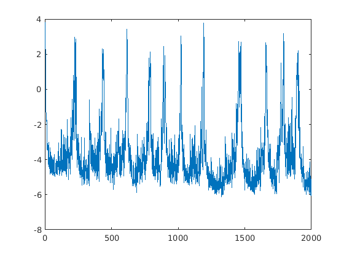
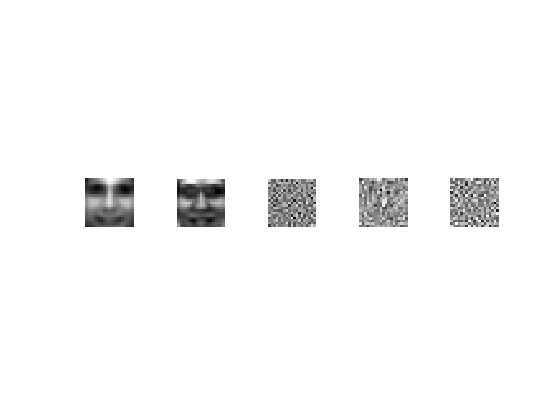
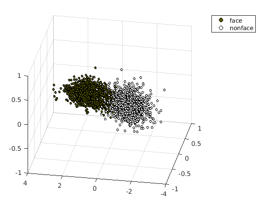

# latent_coincidence_analysis
Latent Coincidence Analysis - based on a paper by Lawrence K. Saul and Matthew Der. A batch style RMS-Prop optimization method.

Batch style... in case a lot of training samples are given. So an RMS-Prop was used.

First two are the mean and variance squared per entry of the dataset, and the other 3 the column vectors of the W found.

Lastly, the projections given:

